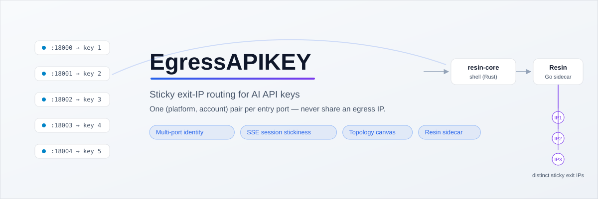
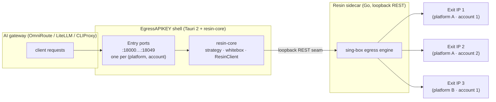

<!-- synced-with: README_CN.md @ 94ad35ccf2da241bbf6538c64ea0dcd286c69022 -->

# EgressAPIKEY

**Multi-port socks5/http proxy gateway between AI gateways and upstream providers — sticky exit-IP routing for AI API keys, with a topology canvas.**

[](https://github.com/Xxx91n/EgressAPIKEY/blob/main/LICENSE) [](https://github.com/Xxx91n/EgressAPIKEY/actions/workflows/ci.yml) [](https://github.com/Xxx91n/EgressAPIKEY/releases)

English | [简体中文](README_CN.md)

> AI / automation agents: see [llms.txt](llms.txt) for a machine-readable map.
> Formerly **ai-api-route** — renamed per [ADR-0013](docs/adr/0013-project-rename-egressapikey.md).

<p align="center">
  <picture>
    <source media="(prefers-color-scheme: dark)" srcset="assets/readme/hero-dark.svg">
    
  </picture>
</p>

## What & why

EgressAPIKEY is a desktop application (Tauri 2 + React 19) that sits between your AI gateway (OmniRoute / LiteLLM / CLIProxy) and upstream OpenAI-compatible v1 providers. It exposes many socks5/http entry ports; each port is the identity of one (platform, account) pair, and a Resin Go sidecar — its binary pulled at build time from the upstream Release by scripts/fetch_resin.sh (resin/ on disk is a gitignored local reference clone, not part of the repo) — guarantees a distinct sticky exit IP per pair — one AI API key never shares an egress IP with another unless you decide it should.

A single unified proxy cannot carry per-key identity for HTTPS upstreams (the CONNECT tunnel hides the destination), so multi-port is the correct identity mechanism ([ADR-0012](docs/adr/0012-route-correction-thin-shell-multi-port.md)). The shell backend core is `crates/resin-core` (Rust: tokio, reqwest, rusqlite); the proxy engine is the Resin sidecar v1.2.0, whose binary is pulled at build time from the upstream Release by [`scripts/fetch_resin.sh`](scripts/fetch_resin.sh) — the `resin/` directory on disk is a gitignored local reference clone — and it is reachable only over a loopback REST seam.

## Architecture

Request flow — the data plane runs in two modes ([ADR-0068](docs/adr/0068-data-plane-dual-mode-mixed-protocol.md)); the diagram below shows Mode A:

- **Mode A — shell forwarder** (desktop default): AI gateway → entry port bound by the shell, no client credentials → the forwarder injects the port's `Platform.Account` identity → Resin sidecar → distinct sticky exit IP.
- **Mode B — engine direct** (headless/VPS default): AI gateway → entry port bound by Resin itself → the client presents the port's `Platform.Account` proxy credential once → sticky exit IP.

<p align="center">
  
</p>

<details>
<summary>Mermaid source (GitHub renders this natively; <code>assets/readme/architecture.svg</code> above is rendered from it)</summary>



</details>
## Download

**Desktop** — installers (MSI / NSIS / deb / AppImage / dmg) and one portable, drop-and-run executable per OS are published on the [Releases](https://github.com/Xxx91n/EgressAPIKEY/releases) page. No tagged release yet — artifacts ship with the first tagged release.

**Headless server** — the same control surface (Platforms, Subscriptions, Nodes, Topology) served in any browser at `http://127.0.0.1:14200`, for Linux servers, Docker, or a remote VPS. The admin bearer token is injected server-side; the browser never sees it. Headless runs data-plane **Mode B**: the Resin engine binds each entry port, and clients present the port's `Platform.Account` proxy credential once (username `Platform.Account`, password = the proxy token). One upstream caveat: plain-HTTP forward-form requests on a Mode B port are buffered by the engine — CONNECT-tunnelled HTTPS traffic, the actual AI API path, streams normally ([ADR-0068](docs/adr/0068-data-plane-dual-mode-mixed-protocol.md)). The `@egressapikey/server` npm launcher is **not published to npm** — run from source:

```bash
git clone https://github.com/Xxx91n/EgressAPIKEY.git
cd EgressAPIKEY
pnpm install && pnpm build
cargo build --release -p egressapikey-app --bin egressapikey-headless --features headless
bash scripts/fetch_resin.sh   # pins the sidecar into src-tauri/binaries/ (or build resin/ with Go)
target/release/egressapikey-headless --dist dist --binary-dir src-tauri/binaries --no-browser
```

On Windows the binary is `target\release\egressapikey-headless.exe`. Deployment layouts (systemd unit, Docker, env table, TLS reverse proxy): [docs/how-to/HEADLESS_DEPLOYMENT.md](docs/how-to/HEADLESS_DEPLOYMENT.md) · operations (logs, health, shutdown): [docs/how-to/HEADLESS_RUNBOOK.md](docs/how-to/HEADLESS_RUNBOOK.md)

## Features

- **Entry port = identity** — one (platform, account) pair per port; Resin binds the sticky exit IP natively
- **Two data-plane modes** — Mode A (desktop): the shell listens on each entry port and injects the port's identity credential toward Resin, so clients need none; Mode B (headless): Resin listens natively and the client presents `Platform.Account` once
- **SSE session stickiness** — a streaming response locks its node until completion, auto-switching on failure
- **Transport pool control** — whitebox `network` knobs (`max_idle_conns`, per-host cap, idle timeout) are passed to the sidecar as `RESIN_PROXY_TRANSPORT_*` env vars
- **Strategy engine** — A-class decides which IPs enter a platform (region / quality / subscription source), B-class picks the port's exit policy — Resin's three real `allocation_policy` values: BALANCED (lease count × latency), PREFER_LOW_LATENCY, PREFER_IDLE_IP
- **Topology canvas** — drag-to-connect hot-patches per-platform region filters on the live sidecar
- **Zero adaptation (Mode A)** — on the desktop, point your gateway at an entry port; client code stays unchanged and no proxy credential is needed. On headless Mode B the client configures the port's `Platform.Account` credential once
- **Headless twin** — the GUI control surface over HTTP, without the desktop shell; commands that require the desktop shell render as disabled with their reason instead of failing at runtime

## Screenshots

<!-- PLACEHOLDER: the three screenshots below are user-provided assets, deliberately NOT fabricated (readme-crafter rule). -->
<!-- Drop-in: replace each comment block with .png" width="1200"> once the real PNG (<=1280px) is provided. -->

<!-- SLOT topology: assets/readme/topology.png — the topology canvas with platforms wired to exit nodes. -->
<!-- SLOT platforms: assets/readme/platforms.png — the platforms dual-pane (platform list + accounts). -->
<!-- SLOT effective-config: assets/readme/effective-config.png — the Effective Config view with the converge-phase chip. -->

_Screenshots pending — reserved for real captures: topology canvas, platforms dual-pane, Effective Config view._

## Quick start (development)

Prerequisites: Node.js 20+ with pnpm, Rust stable, and the platform webview requirements ([Tauri v2 prerequisites](https://tauri.app/start/prerequisites/) — Linux needs `webkit2gtk-4.1` and friends).

```bash
git clone https://github.com/Xxx91n/EgressAPIKEY.git
cd EgressAPIKEY
pnpm install
pnpm tauri dev
```

## Documentation

| Document | Purpose |
| --- | --- |
| [docs/architecture/ARCHITECTURE.md](docs/architecture/ARCHITECTURE.md) | Layers, data flow, config authority (L1/L2/L3), tech stack |
| [docs/architecture/UPSTREAM.md](docs/architecture/UPSTREAM.md) | Upstream Resin integration router: API coverage, version manifest, third-party obligations |
| [docs/RELEASE_NOTES.md](docs/RELEASE_NOTES.md) | Per-release notes with compatibility declarations and upgrade notes |
| [docs/adr/](docs/adr/) | Architectural decision records (numbered, append-only) |
| [docs/how-to/HEADLESS_DEPLOYMENT.md](docs/how-to/HEADLESS_DEPLOYMENT.md) | Headless server deployment (systemd, Docker, TLS) |
| [docs/how-to/HEADLESS_RUNBOOK.md](docs/how-to/HEADLESS_RUNBOOK.md) | Headless operations (logs, health, shutdown, troubleshooting) |
| [docs/how-to/RELEASE.md](docs/how-to/RELEASE.md) | Release pipeline: CI matrix, artifact groups |

## Compliance notice

> **Compliance Note** — This project is for legitimate use only: routing API keys you own, personal automation, research, and learning. You are solely responsible for complying with all applicable laws, regulations, and upstream provider terms of service in your jurisdiction. The authors assume no liability for any misuse.

## Contributing

Issues and pull requests are welcome. Start with [CONTRIBUTING.md](CONTRIBUTING.md) — desktop dev-environment setup and the verification workflow. Security issues follow [SECURITY.md](SECURITY.md) (private vulnerability reporting, never public issues); community behavior is covered by the [Code of Conduct](CODE_OF_CONDUCT.md); questions and open discussion belong in [Discussions](https://github.com/Xxx91n/EgressAPIKEY/discussions). Before your first PR, read [AGENTS.md](AGENTS.md) (repo conventions: i18n full-key coverage, test-per-behavior, license-field discipline) and the [architecture overview](docs/architecture/ARCHITECTURE.md).

## Third-party notices

The Resin Go sidecar (v1.2.0, its binary pulled at build time from the upstream Release by [`scripts/fetch_resin.sh`](scripts/fetch_resin.sh), upstream [github.com/Resinat/Resin](https://github.com/Resinat/Resin)) carries a two-layer license value: **declared MIT** (per its own `LICENSE`) while its compiled dependency tree conveys **GPL-3.0-or-later** obligations via `github.com/sagernet/sing-box v1.12.21` (pinned in `resin/go.mod`). The shell and the sidecar are separate processes interacting only over a loopback REST seam (mere aggregation). Full registry with citations: [THIRD_PARTY.md](THIRD_PARTY.md) · decision record: [ADR-0067](docs/adr/0067-license-layering-provenance.md) · complete license text: [LICENSE](LICENSE).

## License

GPL-3.0-or-later
