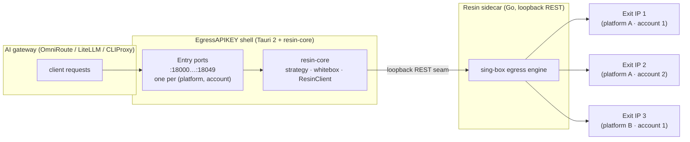

<!-- synced-with: README.md @ 94ad35ccf2da241bbf6538c64ea0dcd286c69022 -->

# EgressAPIKEY

**面向 AI 网关与上游服务商的多端口 socks5/http 代理网关 —— 为 AI API Key 提供粘性出口 IP 路由，并配有拓扑画布。**

[](https://github.com/Xxx91n/EgressAPIKEY/blob/main/LICENSE) [](https://github.com/Xxx91n/EgressAPIKEY/actions/workflows/ci.yml) [](https://github.com/Xxx91n/EgressAPIKEY/releases)

[English](README.md) | 简体中文

> AI / automation agents：机器可读的仓库地图见 [llms.txt](llms.txt)。
> 原名 **ai-api-route** —— 按 [ADR-0013](docs/adr/0013-project-rename-egressapikey.md) 改名。

<p align="center">
  <picture>
    <source media="(prefers-color-scheme: dark)" srcset="assets/readme/hero-dark.svg">
    
  </picture>
</p>

## 是什么与为什么

EgressAPIKEY 是一款桌面应用（Tauri 2 + React 19），位于你的 AI 网关（OmniRoute / LiteLLM / CLIProxy）与上游 OpenAI 兼容 v1 服务商之间。它暴露多个 socks5/http 入口端口；每个端口即一个（平台，账户）身份对的标识，Resin Go 侧车保证每一对都拥有独立的粘性出口 IP —— 除非你明确允许，一个 AI API Key 绝不与其他 Key 共享出口 IP。

单一统一代理无法为 HTTPS 上游携带按 Key 的身份（CONNECT 隧道对目的地不可见），因此多端口才是正确的身份机制（[ADR-0012](docs/adr/0012-route-correction-thin-shell-multi-port.md)）。壳侧后端核心是 `crates/resin-core`（Rust：tokio、reqwest、rusqlite）；代理引擎是 Resin 侧车 v1.2.0，仅通过环回 REST 接缝访问（构建期由 `scripts/fetch_resin.sh` 获取）。

## 架构

请求流向 —— 数据面有两种模式（[ADR-0068](docs/adr/0068-data-plane-dual-mode-mixed-protocol.md)）；下图为 Mode A：

- **Mode A —— 壳侧转发器**（桌面默认）：AI 网关 → 壳绑定的入口端口（客户端免凭据）→ 转发器注入该端口的 `Platform.Account` 身份 → Resin 侧车 → 独立粘性出口 IP。
- **Mode B —— 引擎直听**（headless/VPS 默认）：AI 网关 → Resin 自行绑定的入口端口 → 客户端一次性出示该端口的 `Platform.Account` 代理凭据 → 粘性出口 IP。

<p align="center">
  
</p>

<details>
<summary>Mermaid 源码（GitHub 原生渲染；上方 <code>assets/readme/architecture.svg</code> 由此渲染）</summary>



</details>
## 下载

**桌面版** —— 安装包（MSI / NSIS / deb / AppImage / dmg）与每平台一个免安装、开箱即用的可执行文件发布在 [Releases](https://github.com/Xxx91n/EgressAPIKEY/releases) 页面。目前尚无 tagged release —— 产物将随首个 tagged release 一并发布。

**无头服务器** —— 同一套控制面（平台 / 订阅 / 节点 / 拓扑），可在任意浏览器经 `http://127.0.0.1:14200` 访问，适用于 Linux 服务器、Docker 或远程 VPS。admin bearer 令牌由服务端注入，浏览器永远看不到它。headless 运行数据面 **Mode B**：入口端口由 Resin 引擎自行绑定，客户端一次性出示该端口的 `Platform.Account` 代理凭据（用户名 = `Platform.Account`，密码 = 代理令牌）。上游注意项：Mode B 端口上的纯 HTTP 转发形态请求会被引擎缓冲 —— 经 CONNECT 隧道的 HTTPS 流量（AI API 实际路径）不受影响，正常流式（[ADR-0068](docs/adr/0068-data-plane-dual-mode-mixed-protocol.md)）。`@egressapikey/server` npm 启动器**未发布到 npm** —— 请从源码运行：

```bash
git clone https://github.com/Xxx91n/EgressAPIKEY.git
cd EgressAPIKEY
pnpm install && pnpm build
cargo build --release -p egressapikey-app --bin egressapikey-headless --features headless
bash scripts/fetch_resin.sh   # 将侧车二进制固定拉取到 src-tauri/binaries/（或用 Go 构建 resin/）
target/release/egressapikey-headless --dist dist --binary-dir src-tauri/binaries --no-browser
```

Windows 下二进制为 `target\release\egressapikey-headless.exe`。部署布局（systemd unit、Docker、环境变量表、TLS 反代）：[docs/how-to/HEADLESS_DEPLOYMENT.md](docs/how-to/HEADLESS_DEPLOYMENT.md) · 运维（日志、健康、停机）：[docs/how-to/HEADLESS_RUNBOOK.md](docs/how-to/HEADLESS_RUNBOOK.md)

## 特性

- **入口端口即身份** —— 每端口对应一个（平台，账户）对；Resin 原生绑定粘性出口 IP
- **双数据面模式** —— Mode A（桌面）：壳监听每个入口端口并向 Resin 注入该端口的身份凭据，客户端无需凭据；Mode B（headless）：Resin 原生监听，客户端一次性出示 `Platform.Account` 凭据
- **SSE 会话粘性** —— 流式响应锁定其节点直至完成，失败时自动切换
- **传输连接池可控** —— 白盒 `network` 配置项（`max_idle_conns`、每主机上限、空闲超时）以 `RESIN_PROXY_TRANSPORT_*` 环境变量传给侧车
- **策略引擎** —— A 类策略决定哪些 IP 进入平台（地区 / 质量 / 订阅源），B 类策略决定端口的出口策略 —— Resin 的三个真实 `allocation_policy`：BALANCED（租约数 × 延迟）、PREFER_LOW_LATENCY、PREFER_IDLE_IP
- **拓扑画布** —— 拖拽连线即向在线侧车热更新各平台的 region 过滤器
- **零适配（Mode A）** —— 桌面端把你的网关指向一个入口端口即可；客户端代码无需改动、也无需管理代理凭据。headless Mode B 下客户端需一次性配置该端口的 `Platform.Account` 凭据
- **无头孪生** —— GUI 控制面经 HTTP 提供，无需桌面壳；确需桌面壳的命令在 UI 中显示为禁用并注明原因，而非运行时才失败

## 截图

<!-- 占位：以下三张截图是用户提供的资产，刻意不代生成（readme-crafter 规则）。 -->
<!-- 投放：拿到真实 PNG（<=1280px）后，把每个注释块替换为 .png" width="1200">。 -->

<!-- SLOT topology: assets/readme/topology.png —— 拓扑画布（平台连线到出口节点）。 -->
<!-- SLOT platforms: assets/readme/platforms.png —— 平台双栏（平台列表 + 账户）。 -->
<!-- SLOT effective-config: assets/readme/effective-config.png —— Effective Config 视图与收敛阶段徽标。 -->

_截图待补 —— 预留给真实截屏：拓扑画布、平台双栏、Effective Config 视图。_

## 快速开始（开发）

前置要求：Node.js 20+ 与 pnpm、Rust stable，以及所在平台的 webview 依赖（[Tauri v2 前置要求](https://tauri.app/start/prerequisites/) —— Linux 需要 `webkit2gtk-4.1` 等）。

```bash
git clone https://github.com/Xxx91n/EgressAPIKEY.git
cd EgressAPIKEY
pnpm install
pnpm tauri dev
```

## 文档

| 文档 | 用途 |
| --- | --- |
| [docs/architecture/ARCHITECTURE.md](docs/architecture/ARCHITECTURE.md) | 分层、数据流、配置权威（L1/L2/L3）、技术栈 |
| [docs/architecture/UPSTREAM.md](docs/architecture/UPSTREAM.md) | 上游 Resin 对接总纲：API 覆盖清单、版本清单、第三方义务 |
| [docs/RELEASE_NOTES.md](docs/RELEASE_NOTES.md) | 每版本发布说明：兼容性声明与升级注意事项 |
| [docs/adr/](docs/adr/) | 架构决策记录（编号、只追加） |
| [docs/how-to/HEADLESS_DEPLOYMENT.md](docs/how-to/HEADLESS_DEPLOYMENT.md) | 无头服务器部署（systemd、Docker、TLS） |
| [docs/how-to/HEADLESS_RUNBOOK.md](docs/how-to/HEADLESS_RUNBOOK.md) | 无头服务器运维（日志、健康、停机、故障排查） |
| [docs/how-to/RELEASE.md](docs/how-to/RELEASE.md) | 发布流水线：CI 矩阵、产物分组 |

## 合规声明

> **合规声明** —— 本项目仅用于合法用途：路由你自有的 API Key、个人自动化、研究与学习。你有责任自行遵守所在司法辖区的全部适用法律法规及上游服务商服务条款。作者对任何滥用行为不承担责任。

## 参与贡献

欢迎提交 Issue 与 Pull Request —— 请到 [GitHub Issue](https://github.com/Xxx91n/EgressAPIKEY/issues)。首次提交 PR 前，请先阅读 [AGENTS.md](AGENTS.md)（仓库约定：i18n 全键覆盖、每个行为必须有测试、许可证字段纪律）与[架构总览](docs/architecture/ARCHITECTURE.md)。包含桌面开发环境搭建的独立 `CONTRIBUTING.md` 已列入路线图。

## 第三方声明

Resin Go 侧车（v1.2.0，上游 [github.com/Resinat/Resin](https://github.com/Resinat/Resin)）携带两层许可证值：**声明 MIT**（依其自身 `LICENSE`），而其编译依赖树经 `github.com/sagernet/sing-box v1.12.21`（钉在 `resin/go.mod`）传递 **GPL-3.0-or-later** 义务。壳与侧车是独立进程，仅通过环回 REST 接缝交互（单纯聚合）。完整清单与引用：[THIRD_PARTY.md](THIRD_PARTY.md) · 决策记录：[ADR-0067](docs/adr/0067-license-layering-provenance.md) · 完整许可证文本：[LICENSE](LICENSE)。

## 许可

GPL-3.0-or-later
