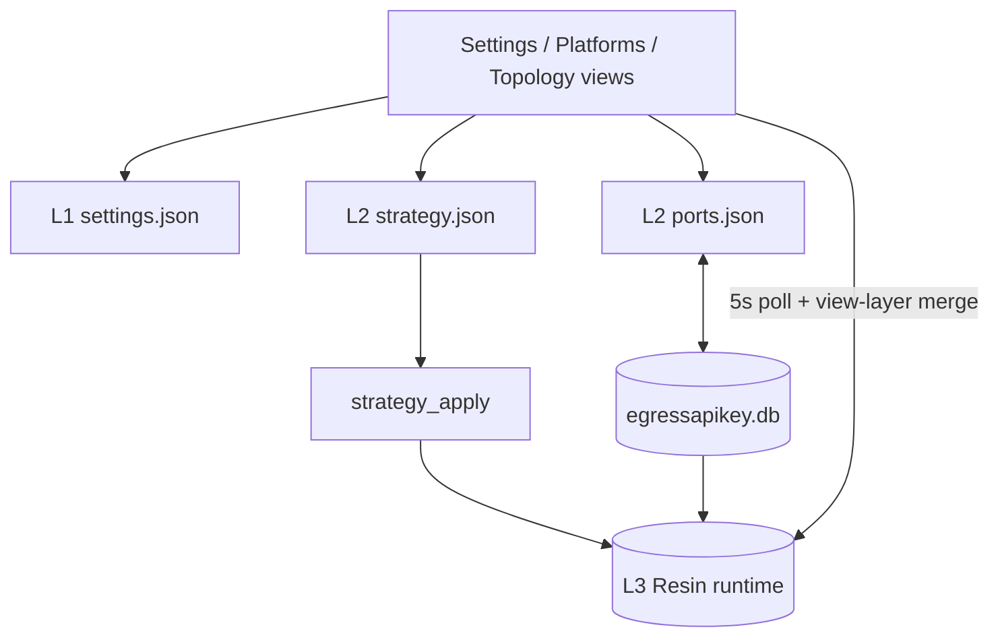
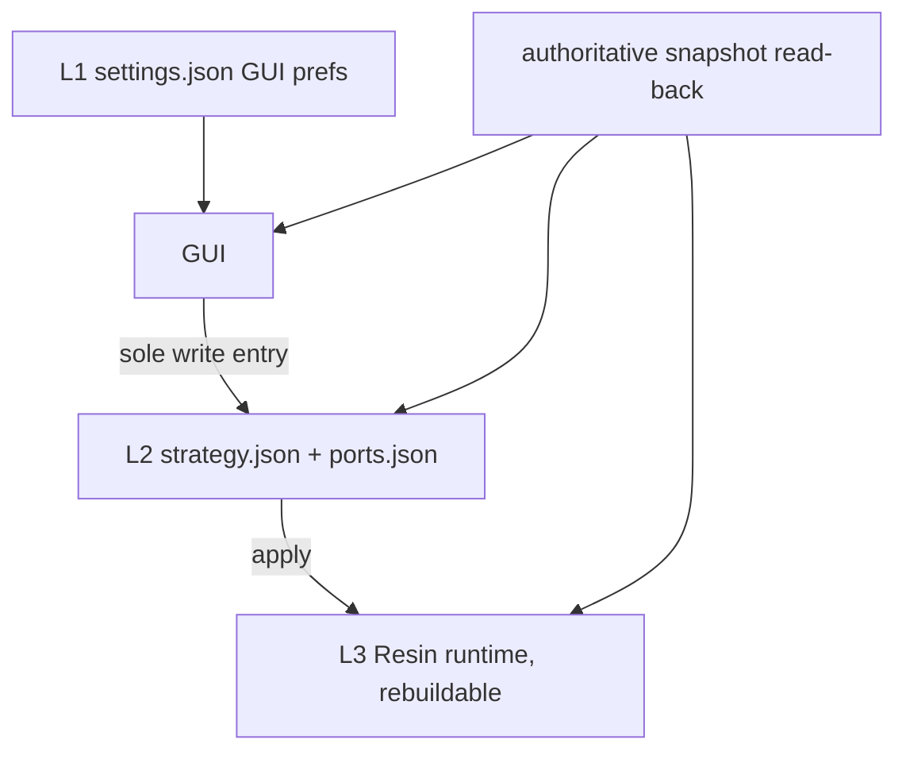

# Architecture - EgressAPIKEY

> Companion to README.md and docs/architecture/MEMORY_REUSE_DECISION.md. Concrete module layout, data flow, and tech stack.

## Architecture: Path A (fork Resin as Tauri sidecar)

Decision: see docs/architecture/MEMORY_REUSE_DECISION.md. Path A embeds the Go Resin binary as a Tauri sidecar; the Rust shell does lifecycle + Ghost safety net + IPC forwarding.

## Layers

React 19 Frontend (src/)

- ReactFlow 12 topology canvas with live sidecar-status banner
- Zustand 5 state (persisted to tauri-plugin-store via src/lib/settings.ts)
- Tailwind CSS + react-i18next (18 base locales)
- 5 tabs: Topology / Platforms / Subscriptions / ProcessRoute / Settings
- Typed IPC wrappers in src/lib/ipc.ts (validate-then-invoke, AGENTS S7.6)

Tauri 2 Shell (src-tauri/)

- sidecar.rs: boot_resin + spawn_health_poll (3s, 3-fail clear-os-proxy)
- commands/mod.rs: 44 #[tauri::command] (platforms/subscriptions/strategy/process_routes/port_auth/port_health/nodes/config_export/whitebox/stream_sensor/ip_reputation) forwarding to Resin via ResinClient
- tray.rs: i18n tray (18 locales), click-to-show

Resin Go Sidecar (bundle.externalBin)

- Control-plane API + proxy + webui on single loopback port
- Admin token: Rust-only trust, never crosses to webview

Resin-pattern Core (crates/resin-core/) - shell-side support crate (ADR-0050)

- resin_client.rs: loopback-only async REST client (SSRF guard + Bearer)
- whitebox_config.rs: egressapikey-ports.json store (ADR-0036); db.rs: SQLite port mapping
- port_forwarder.rs / port_health.rs / strategy_engine.rs / stream_sensor.rs / ip_reputation.rs / ipc_error.rs: live shell support modules
- platform.rs: Platform/Account registry (shell SharedRegistry state)
- lane/lease/tdewma/gateway/mihomo modules + CoreConfig + stub bin: deleted in ADR-0050 (zero external references)

### Config Authority (配置权威)

> This subsection legislates the three-layer configuration authority model. It
> EXTENDS decided ADRs and reopens none of them: ADR-0036 (strategy whitebox
> single write entry), ADR-0039 SS2 (read-side strategy contract), ADR-0042
> S2/S6 (whitebox port truth + restore from whitebox). Where this subsection and
> an ADR appear to conflict, the ADR wins and this subsection gets fixed.

Provenance: 2026-08-29 architecture candidate report + atomcode research #1
(15 sources: clashverge.dev, clash wiki, mihomo wiki, sing-box, v2rayN).
Desktop proxy clients have converged on three config layers plus a merge
chain, and on one rule: **the authoritative source is the write entry**. The
CFW↔Verge merge-semantics incompatibility (upstream issue #847) is the
standing lesson — borrow the layering, not the field semantics.

| Layer | Storage | Sole write entry | Authority semantics |
| --- | --- | --- | --- |
| L1 GUI preferences | `settings.json` (`app_config_dir()`, tauri-plugin-store) | Webview `src/lib/settings.ts` + `lightweight_get/set` / `get_log_level` / `set_log_level` commands | Preference only; never influences proxy behavior |
| L2 Whitebox user-editable | `egressapikey-strategy.json` + `egressapikey-ports.json` (`app_config_dir()`) | Strategy: `strategy_config_put` then `strategy_apply`. Ports + process routes: `WhiteboxConfigStore` (`crates/resin-core/src/whitebox_config.rs`, hotswap-config atomic write; routes via the `process_route_*` commands, ADR-0055) | The file IS the truth; GUI edits and external edits converge here (ADR-0036, ADR-0055) |
| L3 Resin runtime | Resin sidecar state (`state.db`, leases, listeners); shell-side partner `egressapikey.db` (`port_mappings` table) | ResinClient REST seam only (`crates/resin-core/src/resin_client.rs`) | Derived and rebuildable from L2 at any time; execute authority, never a config source |

Write entry = authority, per layer: an L1 key must not change what the proxy
does (if it would, it belongs in L2); L2 is the only layer where a
user-authored file is read back and honored; L3 is never authored by hand —
needing to edit L3 state to change behavior is a bug. No new config storage
may be introduced without re-legislating this subsection. Logs
(`app_log_dir()`, Resin request logs) are observability data, not a layer.

Two distinct write pipelines currently live behind L2 (facts from the
2026-08-29 candidate report, verified in code; `strategy_config_put` /
`strategy_apply` / `port_upsert` / `whitebox_reload` in
`src-tauri/src/commands/mod.rs`):

- Strategy: GUI or JSON edit → `strategy_config_put` (validate, write
  `egressapikey-strategy.json`) → `strategy_apply` (compute plan, PATCH Resin
  `region_filters`, auto-clean stale platform entries and write the file
  back). Destination: ticket 10 converges read/validate/apply/read-back into
  one StrategyService module (ADR-0036 stays in force).
- Ports: `port_upsert` / `port_remove` / `port_toggle` /
  `whitebox_save_network` → `WhiteboxConfigStore` (atomic write +
  validate-before-swap + file watch) → accepted files applied to
  `egressapikey.db` + listeners as one transaction; boot seeds the store from
  the DB, and `restore_ports_from_whitebox` re-POSTs `/api/v1/endpoints` to
  Resin after a sidecar restart (ADR-0042 S6). Three-party sync: whitebox
  JSON ↔ `egressapikey.db` ↔ Resin endpoints, orchestrated in
  `src-tauri/src/main.rs`.

Both whitebox writes are versioned (ticket 15, ADR-0054 §B): before every
atomic swap the current file is copied to the sibling `backup/` directory
under `app_config_dir()` (`<original>.<unixts>[-N].bak`, 10 kept per file,
same-second collisions suffixed, never overwritten), and the two
`*_backup_list` / `*_rollback` IPC pairs list versions and re-enter the
same validate-before-swap → apply chain for rollback (never a bypass);
`backup/` is runtime data, not configuration, and is never committed to git.

Process routes (ticket 17, ADR-0055) are folded into the same L2 discipline:
the `process_routes` + `route_acknowledged` fields live in
`egressapikey-ports.json`; the `process_route_add`/`process_route_remove`
commands are the single write entry (the former L1 settings.json key and the
webview direct-write pair are deleted; a one-time boot migration merges the
legacy value into the whitebox and purges the key, idempotently). A route's
live side IS its target port: the snapshot reports a route consistent when
its port has a Resin listener, missing_on_resin when the port is
enabled-but-listenerless, and consistent when the port is disabled or absent
(inert by intent); route drift joins the unacknowledged-drift counter and the
acknowledged vocabulary; the one-way reconcile converges routes through the
existing ports-restore half (Resin has no per-process API — verified against
upstream). The snapshot is the ONLY sanctioned cross-store merge point.

Current wiring (before ticket 07 — views poll and merge across stores):

Target state (one write entry per layer + one authoritative read-back):

Effective-snapshot read-back contract (ticket 07 prerequisite): a single deep
IPC (authoritative-snapshot semantics) returns the merged effective
configuration in ONE call, reading three sources (L2 strategy JSON, L2 ports
JSON + `egressapikey.db`, L3 Resin runtime) and marking divergence per
platform/port. Each entry is in exactly one of three states:

- `consistent` — whitebox and Resin runtime agree.
- `divergent` — both sides readable but disagree (apply failed or was
  overridden); the snapshot carries both values and never silently picks one.
- `missing` — one side is absent (e.g. a platform exists in the whitebox but
  not in Resin, or a port's Resin endpoint vanished).

Reconciliation closure (Round 2, ADR-0054 ACCEPTED): the loop above is
closed by four increments, all read-side or explicitly user-triggered —
never automatic:

1. **Metadata** (ticket 12): `lastCheckedAt` stamps each snapshot's
   generation instant; `divergentSince` is the first-drift instant per
   entity kept in PROCESS-LOCAL memory only (a restart clears it and a
   re-drift re-times); an `acknowledged` array per whitebox marks
   user-exempted entities — exemptions NEVER touch the three-state merge,
   they only degrade the badge to grey "known" and silence the notification.
2. **View** (ticket 13): the one-level Effective Config view
   (`effectiveConfig`, nav slot before diagnostics) consumes the snapshot
   read-only — desired|live columns, three-state badges, timestamps, manual
   re-check; zero write paths.
3. **Reconcile** (ticket 14): a single user-triggered `reconcile_now` runs
   the previewed, serial strategy-apply + ports-restore with the whitebox
   ALWAYS winning (one-way); no "accept current state" reverse write exists.
4. **Versioned whitebox** (ticket 15): every atomic whitebox write first
   copies the previous file to the sibling `backup/` directory (10 kept
   per file) and the listed backups roll back through the SAME
   validate-before-swap -> apply chain — never a bypass.

**Tray notification** (ticket 16): once per process, the FIRST snapshot
containing unacknowledged drift fires one OS notification (state machine in
`src-tauri/src/tray.rs`, hooked on the snapshot command tail); the state
re-arms only after a snapshot reports zero unacknowledged drift. Sidecar-down
absence never notifies (ADR-0051). See `docs/how-to/WHY-NOT-EFFECTIVE.md`
for the user-facing troubleshooting table.

The snapshot is the ONLY sanctioned cross-store merge point. View layers
consume it and must not re-merge stores. Implemented 2026-08-30 (ticket 07,
ADR-0051): the former `TopologyView.tsx` `sync()`-time merge of
`cfgRaw.platforms` into Resin platform rows is deleted; the view polls the
`authoritative_snapshot` IPC, and the merge lives in
`crates/resin-core/src/snapshot.rs` (pure, unit-tested against the three
legislated fixtures). Adding a new view-layer merge is a review blocker.

## Data flow

1. boot_resin allocates port, spawns Go sidecar, polls /healthz
2. Frontend IPC -> #[tauri::command] validates -> ResinClient -> Resin REST
3. Ghost health poll: 3s /healthz, 3 fails -> tray red + clear OS proxy
4. TopologyView subscribes sidecar-status -> red banner on unhealthy

## Tech stack

Desktop shell: Tauri 2 (Rust)
Frontend: React 19, Vite 6, ReactFlow 12, Zustand 5, Tailwind 4, react-i18next
Sidecar: Resin Go binary (github.com/Resinat/Resin v1.2.0)
Tests: cargo test (100), vitest (123), playwright
Packaging: tauri build --features custom-protocol -> release/

## Fallback

If a platform Tauri build is blocked, ship the headless backend target.
